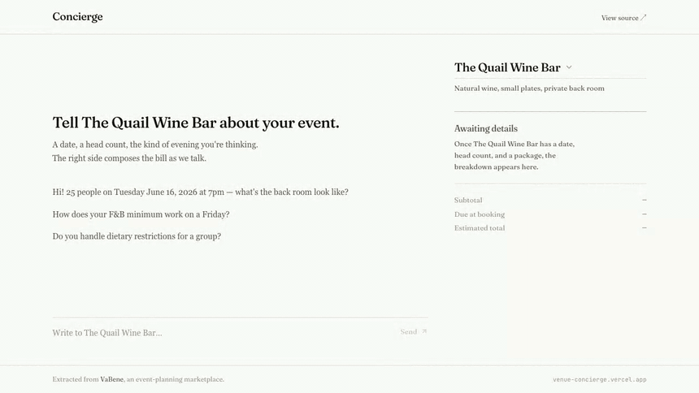

# Venue Concierge

> An AI concierge that gathers what it needs from a customer and produces a venue quote. Extracted from [VaBene](https://github.com/), an event-planning marketplace I've been building. The pricing engine in [`src/lib/pricing/`](src/lib/pricing/) handles two pricing models, day-of-week overrides, and time-window overrides — the kind of edge cases that show up when you talk to actual venue operators. The agent in [`src/lib/agent/`](src/lib/agent/) represents a single venue, gathers what it needs from the customer, and produces a quote.

<!-- Replace with hero.gif once recorded. Spec: 8–12s, prompt → tool pills firing → quote animating in on the right. -->


[Live demo](#) · [Pricing tests](src/lib/pricing/pricing.test.ts) · [Agent evals](evals/cases.ts)

## What's interesting

- **Per-venue agent identity.** The concierge represents one venue, not a neutral helper across many. Each venue ships with a `voice.tone` descriptor and 2-3 hand-written `(customer, venue)` exchanges in [`data/venues.voice.json`](data/venues.voice.json) (server-only) layered on top of the public catalog in [`data/venues.public.json`](data/venues.public.json); the voice file is imported only by [`src/lib/venues.server.ts`](src/lib/venues.server.ts) — marked `server-only` — so few-shot prose never enters the client bundle. Examples are inserted into the cached prefix of the system prompt via [`src/lib/agent/system-prompt.ts`](src/lib/agent/system-prompt.ts). Same agent, three different voices.
- **Claude tool-use loop with SSE streaming** in Next.js App Router ([`src/lib/agent/stream.ts`](src/lib/agent/stream.ts) + [`src/app/api/chat/route.ts`](src/app/api/chat/route.ts)). Tool calls surface in the UI as inline `→ tool_name(args) ✓` pills while the model is running. The route forwards `req.signal` to the Anthropic stream so closing the browser tab cancels the upstream request instead of paying for tokens nobody will read.
- **Production pricing math** lifted verbatim from VaBene. Two pricing models (FlatFee, FbMinimum), day-of-week + time-window overrides, split fees that apply at booking vs reconciliation. [24 vitest cases](src/lib/pricing/pricing.test.ts) cover the override paths, the midnight-wrapping time window, the DST boundary, and the FlatFee vs FbMinimum tab-credit difference.
- **Agent evals, not just vibes.** [6 cases](evals/cases.ts) assert on observable behavior at `temperature: 0` — tool call counts, ordering, argument values — never on phrasing. Clarifies when vague, refuses to invent prices, recovers from a `UNKNOWN_PACKAGE` tool error without retrying the bad ID, surfaces alternate dates when a date is blocked.
- **Token economics.** Anthropic prompt caching on the (voice + catalog) prefix keeps multi-turn cost flat — the catalog ships once per conversation, not once per turn.
- **Per-venue conversation buckets.** [`src/lib/useChatStream.ts`](src/lib/useChatStream.ts) keeps a separate message history, quote, and stream per venueId. Switching venues doesn't tear anything down; in-flight streams keep writing into their own bucket. Talk to venue A, switch to B mid-stream, come back and A's reply is already there.
- **Production sensibility.** Per-IP rate limit on `/api/chat` ([`src/lib/ratelimit.ts`](src/lib/ratelimit.ts)) so a curious recruiter can't drain the API budget. Structured tool errors with `suggested_action` ([`src/lib/agent/errors.ts`](src/lib/agent/errors.ts)). The route restricts client-sent message content to plain strings, so a crafted client can't inject fabricated `tool_use` / `tool_result` blocks claiming the venue agreed to a price the math never produced.

## Run it locally

Requires Node 20+, an Anthropic API key, and (optionally) an Upstash Redis project for the public-demo rate limit.

```bash
git clone …
cd venue-quote-concierge
npm install
cp .env.example .env.local        # then add your ANTHROPIC_API_KEY
npm run dev
# → http://localhost:3000
```

`.env.local` keys (see [`.env.example`](.env.example)):

| Variable                     | Required | Purpose                                        |
| ---------------------------- | -------- | ---------------------------------------------- |
| `ANTHROPIC_API_KEY`          | yes      | Used by the agent loop.                        |
| `UPSTASH_REDIS_REST_URL`     | no       | Per-IP rate limit on `/api/chat`. Optional locally; set before deploying publicly. |
| `UPSTASH_REDIS_REST_TOKEN`   | no       | Same.                                          |

## Test, build, eval

```bash
npm run typecheck      # tsc --noEmit
npm test               # 67 vitest cases across pricing, chat policy, tools, and SSE parser
npm run build          # next build
npm run eval           # 6 agent evals at temperature 0 (needs ANTHROPIC_API_KEY)
```

`npm run eval` writes a transcript to `evals/transcripts/{case}-{stamp}.json` whenever an assertion fails, so you can read the agent's actual output instead of guessing at what missed. Pass `--save-all` to keep transcripts for passing cases too, or `--case=<name>` to run a single one.

## How the agent works

1. **Identity + behavior + voice + catalog** are stitched into the system prompt in [`src/lib/agent/system-prompt.ts`](src/lib/agent/system-prompt.ts). The voice + catalog blocks are marked `cache_control: ephemeral` so multi-turn token cost stays flat.
2. **Two tools** in [`src/lib/agent/tools.ts`](src/lib/agent/tools.ts):
   - `check_availability({ dateISO, time?, guests })` — respects the venue's `weeklyHours`, plus a deterministic static rule (weekends in August, the first Friday of each month) that's defensible in an interview. Returns up to three `alternateDates` from a forward walk so the agent can recover.
   - `compute_quote({ packageId, dateISO, time, guests, spaceId? })` — wraps the lifted `computeBreakdown` math. Auto-resolves the space when the package allows only one; raises `AMBIGUOUS_SPACE` when it doesn't, instead of guessing.
3. **The tool loop** in [`src/lib/agent/stream.ts`](src/lib/agent/stream.ts) streams text deltas live, then runs tool blocks after each message completes (so pills carry fully-assembled arguments instead of streaming-in fragments). Bails after `MAX_ITERATIONS = 6` to keep a runaway loop from burning tokens.
4. **The route** ([`src/app/api/chat/route.ts`](src/app/api/chat/route.ts)) serialises each event as SSE, handles client disconnects by aborting upstream, and emits a terminal `error` event on any unhandled throw.

## What's seeded

Three fictional venues split across [`data/venues.public.json`](data/venues.public.json) (client-safe catalog) and [`data/venues.voice.json`](data/venues.voice.json) (server-only voice prose). Both are parsed through [`src/lib/pricing/venueSchema.ts`](src/lib/pricing/venueSchema.ts) at module load, with a cross-check that every public venue has a voice entry — a malformed seed fails boot rather than the first request.

| Venue                | Pricing model     | Voice                                   |
| -------------------- | ----------------- | --------------------------------------- |
| The Quail Wine Bar   | FbMinimum + DOW/time overrides | Warm, casual, neighborhood-spot |
| Upper Floor Rooftop  | FlatFee (group + per-guest)    | Clipped, modern, event-planner crisp |
| Maison Vert          | FlatFee (per-guest only, prix-fixe) | Formal, French-inflected |

The contrast across pricing models is the point — the same agent + same tools cope with all three, and the voice differences are observable across a single conversation switch.

## Tech

Next.js 16 (App Router) · React 19 · TypeScript · Tailwind v4 · Anthropic SDK · Upstash Redis · Vitest · Zod.

## What I learned

<!-- Filled in after shipping. Two or three bullets on actual surprises. -->
_To be added after the first user feedback round._
